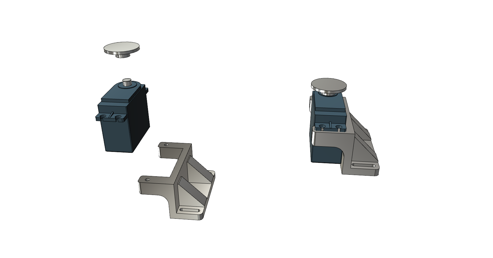
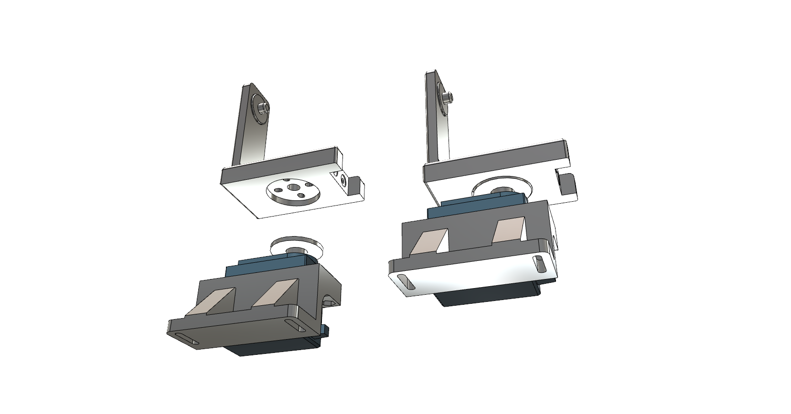
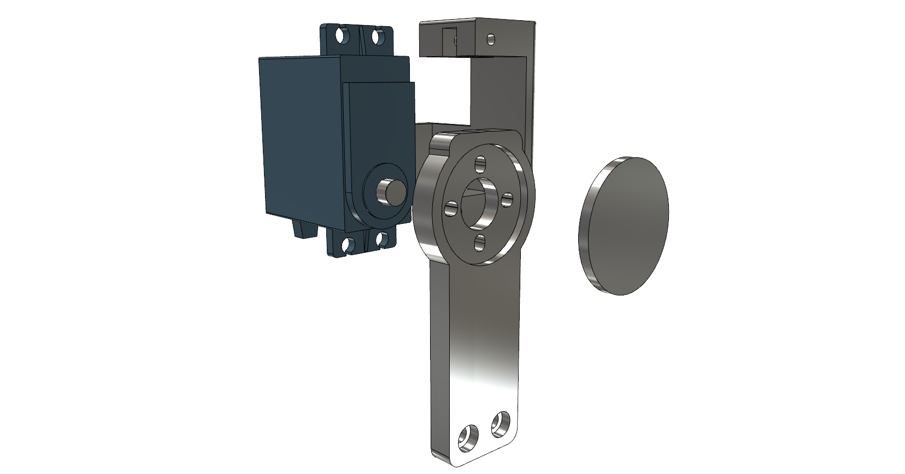
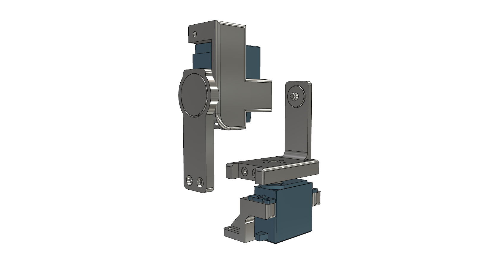
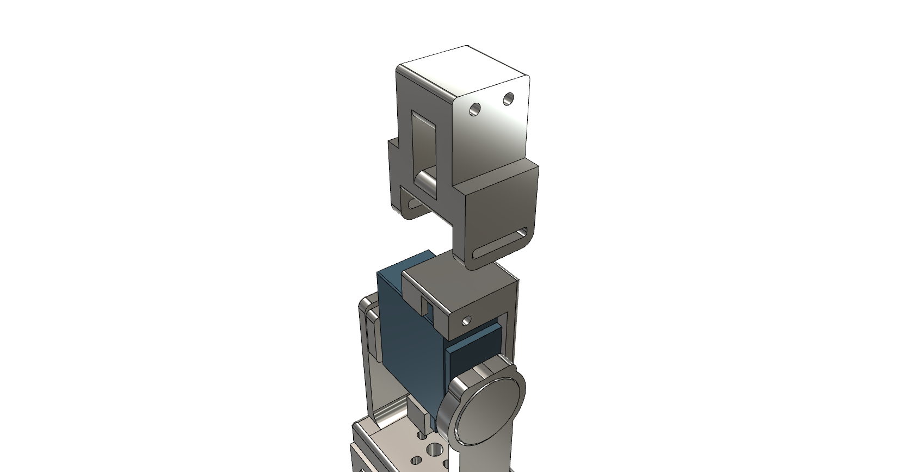
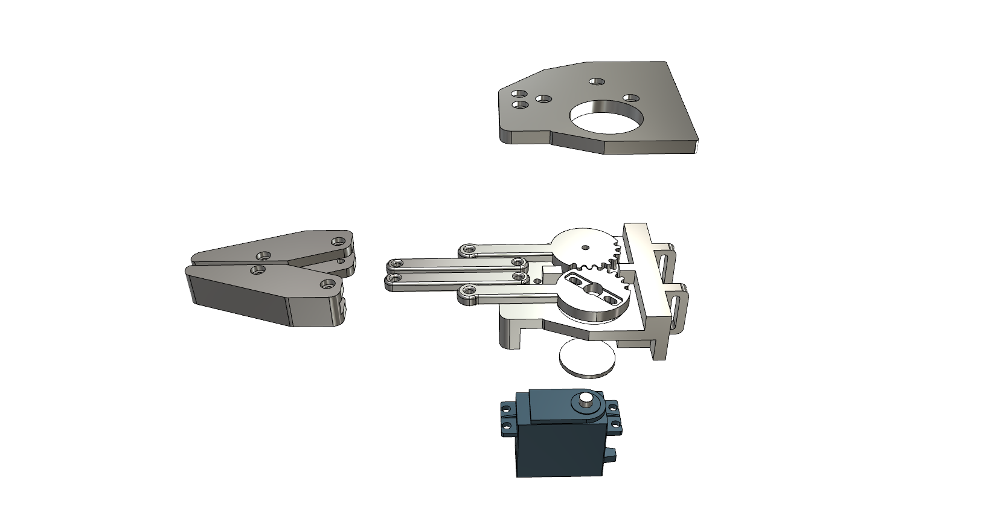

# 3DOF-RobotARM

# サンプルコード

# 組み立て方法

# 土台（共通パーツ）

※ネジ表示は省略。

手順1.　サーボにアームホーンとarm1.stlを取り付ける。

手順2.　手順１で取り付けたアームホーンにarm2.stlを取り付ける。

手順3.　サーボにarm3.stl、arm4.stlとアームホーンを取り付ける。

手順4.　手順２と手順３で組み立てたパーツを取り付ける。

手順5.　手順３で組み立てたパーツの先にarm5.stlを取り付ける。

# クリッパーはさみタイプ

